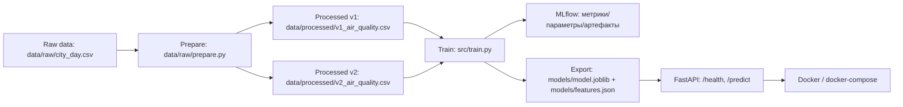

# Курсовой проект по дисциплине «Операционализация моделей машинного обучения»

Проект: **предсказание индекса качества воздуха (AQI)** по концентрациям загрязняющих веществ.

В проекте есть:
- версии данных (v1/v2),
- обучение и трекинг экспериментов в **MLflow**,
- сервис инференса на **FastAPI**,
- контейнеризация (**Docker**).

---

## 1) Архитектура пайплайна



---

## 2) Структура репозитория

| Путь / файл | Назначение |
|---|---|
| `data/raw/city_day.csv` | исходный датасет |
| `data/raw/prepare.py` | создание версий датасета (v1/v2) |
| `data/processed/v1_air_quality.csv` | версия 1 данных |
| `data/processed/v2_air_quality.csv` | версия 2 данных |
| `src/preprocess.py` | единый препроцессинг (train+inference) |
| `src/train.py` | обучение + логирование в MLflow + экспорт артефактов |
| `api/main.py` | FastAPI приложение |
| `api/inference_service.py` | загрузка модели + предсказание |
| `configs/config.yaml` | конфиг (train / inference секции) |
| `configs/.env` | переменные окружения (MODEL_PATH, MLFLOW_TRACKING_URI и т.д.) |
| `Dockerfile` | контейнер инференса |
| `docker-compose.yml` | запуск контейнера **одной командой** |
| `MODEL_CARD.md` | описание модели |
| `DATASET_CARD.md` | описание датасета |

---

## 3) Быстрый старт (инференс в Docker)

Требование «собрать и запустить одной командой» выполнено через `docker compose`:

```bash
docker compose up --build
```

После запуска:
- Swagger: `http://localhost:8000/docs`
- Healthcheck: `GET http://localhost:8000/health`

---

## 4) Эндпоинты

### `GET /health`
Возвращает статус сервиса и факт загрузки модели.

### `POST /predict`
Принимает JSON (12 числовых признаков) и возвращает предсказание AQI.

Пример запроса:

```json
{
  "PM2_5": 81.40,
  "PM10": 124.50,
  "NO": 1.44,
  "NO2": 20.50,
  "NOx": 12.08,
  "NH3": 10.72,
  "CO": 0.12,
  "SO2": 15.24,
  "O3": 127.09,
  "Benzene": 0.20,
  "Toluene": 6.50,
  "Xylene": 0.06
}
```

Ответ:

```json
{
  "prediction": 186.9
}
```

### `POST /predict_file` (опционально)
Принимает CSV-файл и возвращает список предсказаний.
Ожидаемые колонки в CSV: `PM2.5, PM10, NO, NO2, NOx, NH3, CO, SO2, O3, Benzene, Toluene, Xylene`.

---

## 5) Подготовка данных (2 версии датасета)

```bash
python data/raw/prepare.py
```

Скрипт создаёт:
- `data/processed/v1_air_quality.csv`
- `data/processed/v2_air_quality.csv`

---

## 6) Обучение и трекинг экспериментов в MLflow

### 6.1 Запуск одного обучения

```bash
python -m src.train --config configs/config.yaml
```

### 6.2 Требование «минимум 3 эксперимента»

Запусти **три разных** run (разные модели/гиперпараметры/датасет):

```bash
# Эксперимент 1: Linear Regression на v1
python -m src.train --dataset data/processed/v1_air_quality.csv --model linear --run-name "linear_v1"

# Эксперимент 2: Random Forest на v2
python -m src.train --dataset data/processed/v2_air_quality.csv --model random_forest --run-name "rf_v2"

# Эксперимент 3: LightGBM на v2
python -m src.train --dataset data/processed/v2_air_quality.csv --model lightgbm --run-name "lgbm_v2"
```

В каждом run логируются:
- `dataset_path`, `model_type`, `preprocess_version`, гиперпараметры,
- метрики `mse / mae / r2`,
- артефакты `models/model.joblib`, `models/features.json`, `models/training_metadata.json`.

### 6.3 MLflow UI

```bash
mlflow ui --backend-store-uri sqlite:///mlflow.db --port 5000
```

UI будет доступен по адресу `http://127.0.0.1:5000`.

---


